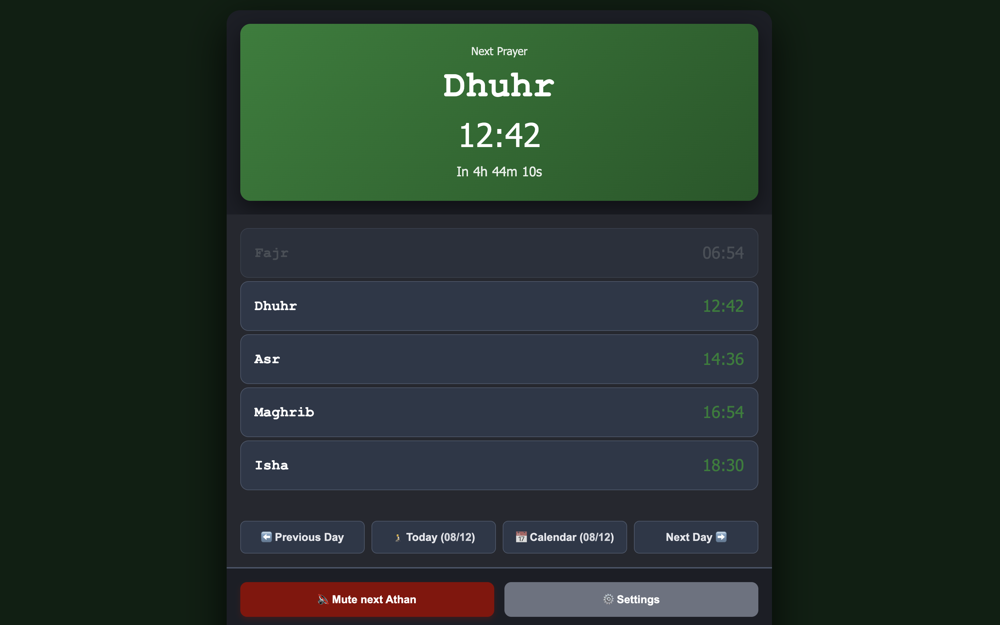
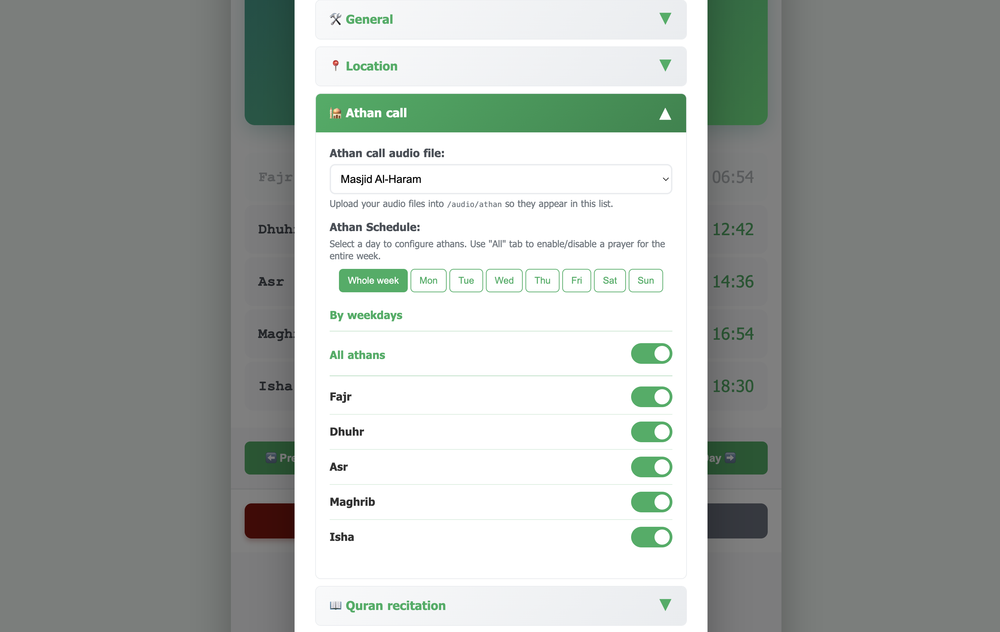
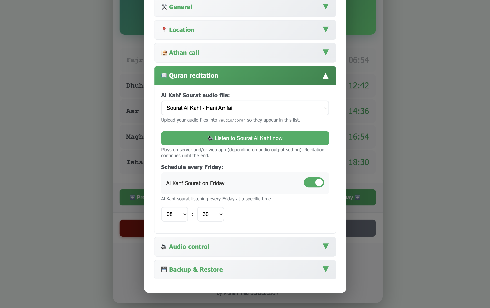
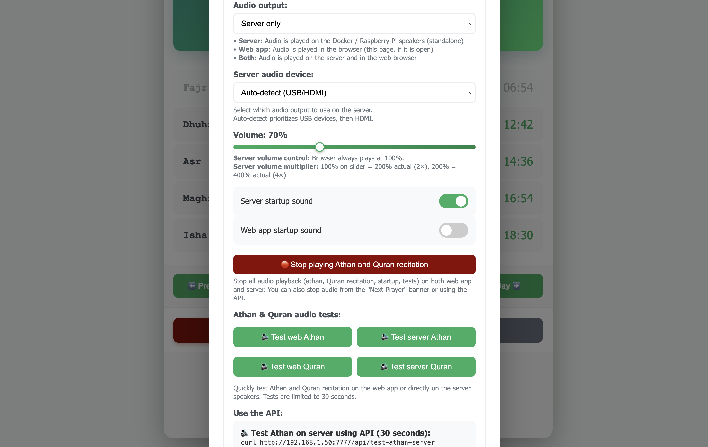

# 🕌 Athan Center

Athan Center is a complete solution for Islamic prayer call at home or in mosques. It allows you to track prayer times on a modern web interface and automatically call for the Athan through a background service.
The solution is optimized for Raspberry Pi and Linux with Docker but works in MacOS and Windows too.

**May Allah accept your prayers** 🤲

## ✨ Key Features

- 🔊 **Automatic Athan playback** at the exact moment of each prayer
- 📅 **Prayer times display** with real-time countdown
- 📍 **Customizable location** via ICS link (Prayer WebCal)
- ⚙️ **Per-prayer settings** - Individual enable/disable
- 🔇 **One-time skip** - Mute next athan only
- 📱 **Responsive interface** - Accessible from mobile/tablet/desktop
- 🌐 **REST API** - Remote control (mute, stop audio, etc.)
- 🔄 **Automatic updates** - Prayer times updated daily at 7 PM
- 💾 **Export/Import** configuration
- 🐳 **Docker** - One-command deployment

## 🖥️ Screenshots

| [](./screens/1.png) | [](./screens/2.png) | [](./screens/3.png) | [](./screens/4.png) |
| --- | --- | --- | --- |

## 🚀 Production Deployment

Deploy Athan Center on **Linux, macOS, or Windows** using Docker Hub.

### 📋 Prerequisites

- **OS**: Linux, macOS, or Windows
- Docker and Docker Compose installed
- Audio device `/dev/snd` (for Linux/Raspberry Pi with speakers)
- Port 7777 available

### ✨ Quick Deployment (Recommended)

Use the **automatic deployment script** that works on all platforms:

```bash
mkdir athan-center && cd athan-center

# Download deployment files
wget https://raw.githubusercontent.com/your-username/athan-center/main/prod_deploy/docker-compose.yml
wget https://raw.githubusercontent.com/your-username/athan-center/main/prod_deploy/start.sh
chmod +x start.sh

# Start (auto-detects OS and configures accordingly)
./start.sh
```

Using 'start.sh' is recommended for MacOS and Windows platforms only. It's not required to use in Linux systems.

## ⚙️ How does it work?

### 1. Prayer times retrieval
- Application fetches prayer times from an ICS file : [Prayer WebCal](https://prayerwebcal.dsultan.com/)
- Storage in local SQLite database
- Automatic daily update at 7 PM (3 months ahead)

### 2. Prayer time detection
- Checks current time every second
- Precise detection of exact prayer moment (±60 seconds window)
- Smart timezone handling (server-client synchronization)

### 3. Athan playback
- **Server**: Audio playback via sox/alsa on system speakers
- **Browser**: Audio playback in browser (if page is open)
- **Choice**: Server only, browser only, or both

### 4. Web interface
- Real-time display of prayer times and countdown
- Settings control (enable/disable per prayer)
- Access from any device on local network

### 5. Remote control
- REST API for integrations (Home Assistant, scripts, etc.)
- Mute next athan: `curl http://IP:7777/api/mute-next-athan`
- Stop all playing audio in the server: `curl http://172.18.0.2:7777/api/stop-audio`
- Test Athan on server (30 seconds): `curl http://IP:7777/api/test-athan-server`
- Test Quran on server (30 seconds): `curl http://IP:7777/api/test-quran-server`

## 📄 License

This project is distributed under the **GNU General Public License version 3 (GPLv3)**.  
By using, modifying, or redistributing this software, you accept the terms of this license.

## 🛠️ Technologies

- **Backend**: Node.js, Express.js, SQLite
- **Audio**: sox, alsa, play-sound
- **Frontend**: HTML5, CSS3, JavaScript
- **Containerization**: Docker
- **Scheduling**: node-cron, node-schedule

---

🤲🙏 Don't forget your brother in your du'a 🤲🙏 لا تنسى أخاك في دعائك 🤲🙏

## Production

[OPEN SOURCE PROJECT (GNU v3.0)](https://github.com/simoroco/athan-center)

[ICS location configuration link](https://prayerwebcal.dsultan.com/ics/Les_Lilas/cq=0:csr=0:ct=0:ee=0:fv=14.0:iv=20.0:qs=0:srs=0:ss=0:sus=0:ts=0:tz=Europe%2FParis:x=48.88:y=2.416)
