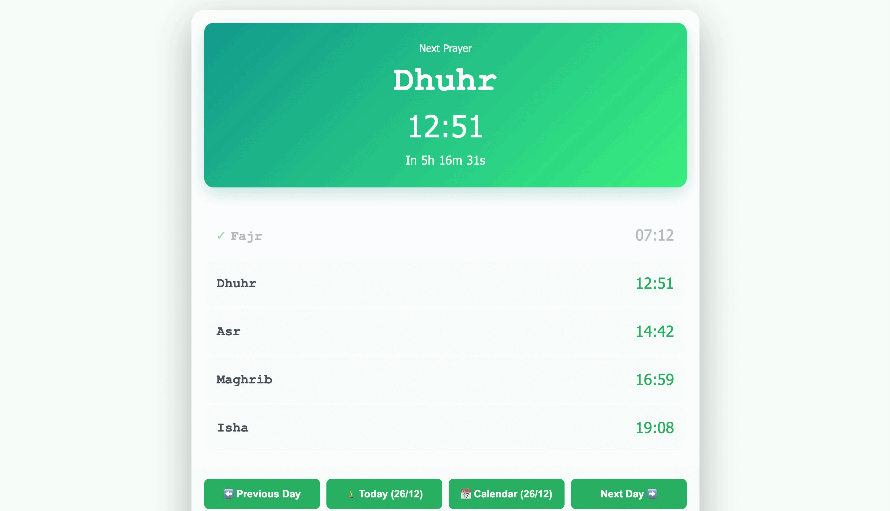

# 🕌 Athan Center

<p align="center">
  
</p>

<p align="center">
  <strong>Complete Islamic Prayer Times & Automated Athan Solution</strong>
</p>

<p align="center">
  <a href="https://github.com/simoroco/athan-center/stargazers"></a>
  <a href="https://github.com/simoroco/athan-center/issues"></a>
  <a href="https://github.com/simoroco/athan-center/network/members"></a>
  <a href="https://github.com/simoroco/athan-center/blob/main/LICENSE"></a>
  <a href="https://hub.docker.com/r/simoroco/athan-center"></a>
  
  
</p>

<p align="center">
  <em>A modern, self-hosted solution for Islamic prayer times with automatic Athan playback</em><br>
  <em>Perfect for homes, mosques, and Islamic centers</em>
</p>

---

**May Allah accept your prayers** 🤲 **لا تنسى أخاك في دعائك**

Athan Center provides accurate prayer times with automatic Athan playback through a beautiful web interface. Optimized for Raspberry Pi and Docker, it works seamlessly on Linux, macOS, and Windows.

⭐ **Star this repo** if it helps your mosque or home • 🐛 **Report issues** • 🤝 **Contribute**

## 📚 Table of Contents

- [✨ Key Features](#-key-features)
- [⚡ Quick Start](#-quick-start)
- [🚀 Production Deployment](#-production-deployment)
- [⚙️ How does it work?](#-how-does-it-work)
- [🔌 Remote control API](#-remote-control-api)
- [📄 License](#-license)
- [🛠️ Technologies](#-technologies)
- [🤝 Community & Roadmap](#-community--roadmap)

## ✨ Key Features

- 🔊 **Automatic Athan playback** at the exact moment of each prayer
- 📅 **Prayer times display** with real-time countdown
- 📍 **Customizable location** via ICS link (Prayer WebCal)
- ⚙️ **Per-prayer settings** - Individual enable/disable
- 🔇 **One-time skip** - Mute next athan only
- 📱 **Responsive interface** - Accessible from mobile/tablet/desktop
- 🌐 **REST API** - Remote control (mute, stop audio, etc.)
- 🔄 **Automatic updates** - Prayer times updated daily at 7 PM
- 💾 **Export/Import** configuration
- 🐳 **Docker** - One-command deployment

## ⚡ Quick Start

```bash
git clone https://github.com/simoroco/athan-center.git
cd athan-center
npm install
npm run dev
```

- Default UI: `http://localhost:7777`
- Configure location via [Prayer WebCal ICS](https://prayerwebcal.dsultan.com/)
- Docker image: [simoroco/athan-center](https://hub.docker.com/r/simoroco/athan-center)

```bash
docker pull simoroco/athan-center:latest
# OR publish from your fork
docker push simoroco/athan-center:latest
```

## 🖥️ Demo

<p align="center">
  
</p>

> **Note:** The animated demo shows the main features of Athan Center including prayer times display, settings configuration, and audio controls.

## 🚀 Production Deployment

Deploy Athan Center on **Linux, macOS, or Windows** using Docker Hub.

### 📋 Prerequisites

- **OS**: Linux, macOS, or Windows
- Docker and Docker Compose installed
- Audio device `/dev/snd` (for Linux/Raspberry Pi with speakers)
- Port 7777 available

### ✨ Quick Deployment (Recommended)

Use the **automatic deployment script** that works on all platforms:

```bash
mkdir athan-center && cd athan-center

# Download deployment files
wget https://raw.githubusercontent.com/your-username/athan-center/main/prod_deploy/docker-compose.yml
wget https://raw.githubusercontent.com/your-username/athan-center/main/prod_deploy/start.sh
chmod +x start.sh

# Start (auto-detects OS and configures accordingly)
./start.sh
```

Using 'start.sh' is recommended for MacOS and Windows platforms only. It's not required to use in Linux systems.

## ⚙️ How does it work?

### 1. Prayer times retrieval
- Application fetches prayer times from an ICS file : [Prayer WebCal](https://prayerwebcal.dsultan.com/)
- Storage in local SQLite database
- Automatic daily update at 7 PM (3 months ahead)

### 2. Prayer time detection
- Checks current time every second
- Precise detection of exact prayer moment (±60 seconds window)
- Smart timezone handling (server-client synchronization)

### 3. Athan playback
- **Server**: Audio playback via sox/alsa on system speakers
- **Browser**: Audio playback in browser (if page is open)
- **Choice**: Server only, browser only, or both

### 4. Web interface
- Real-time display of prayer times and countdown
- Settings control (enable/disable per prayer)
- Access from any device on local network

### 5. Remote control
- REST API for integrations (Home Assistant, scripts, etc.) — see [🔌 Remote control API](#-remote-control-api)

## 🔌 Remote control API

All endpoints are available on `http://IP:7777/api`.

| Action | Endpoint | Notes |
| --- | --- | --- |
| Mute next athan | `/mute-next-athan` | Skips only the upcoming prayer |
| Stop current audio | `/stop-audio` | Immediately stops every active stream |
| Test Athan (server) | `/test-athan-server` | Plays 30 s sample through speakers |
| Test Quran (server) | `/test-quran-server` | 30 s Quran recitation |
| Next prayer text | `/next-prayer-text?lang=FR` | Returns next prayer in natural language (FR/EN) |

For complete API documentation, see [API.md](./docs/API.md).

## 📄 License

This project is distributed under the **GNU General Public License version 3 (GPLv3)**.  
By using, modifying, or redistributing this software, you accept the terms of this license.

## 🛠️ Technologies

- **Backend**: Node.js, Express.js, SQLite
- **Audio**: sox, alsa, play-sound
- **Frontend**: HTML5, CSS3, JavaScript
- **Containerization**: Docker
- **Scheduling**: node-cron, node-schedule

## 🌍 Community & Roadmap

- ⭐️ Star the repo if it helps your mosque or home.
- 🐛 [Open an issue](https://github.com/simoroco/athan-center/issues) for bugs or feature ideas.
- 🙌 Check the roadmap and “good first issue” label to start contributing.

🤲🙏 Don't forget your brother in your du'a 🤲🙏 لا تنسى أخاك في دعائك 🤲🙏
